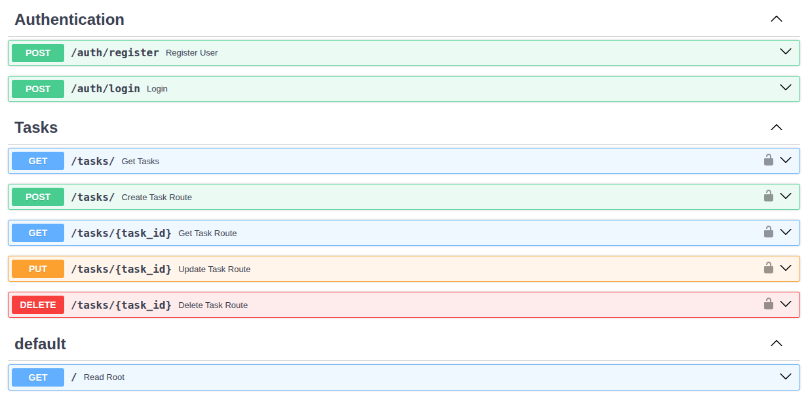

# Task Manager Backend

A FastAPI-based backend for managing tasks with user authentication using JWT. This project allows users to register, log in, and perform CRUD operations on tasks, with SQLite as the database.


## Table of Contents
- [API Live](#api-live)
- [API Documentation](#api-documentation)
- [Features](#features)
- [Tech Stack](#tech-stack)
- [Project Structure](#project-structure)
- [Setup and Installation](#setup-and-installation)
- [API Endpoints](#api-endpoints)
- [Example Usage](#example-usage)
- [Contributing](#contributing)
- [License](#license)

## API Live
- https://task-manager-backend-ivis.onrender.com/

## API Documentation
- Swagger UI: https://task-manager-backend-ivis.onrender.com/docs



## Features

- ✅ **User Authentication**: Register and log in users with JWT-based authentication
- ✅ **Task Management**: Create, read, update, and delete tasks for authenticated users
- ✅ **Secure Passwords**: Passwords are hashed using bcrypt
- ✅ **Database**: SQLite for lightweight storage
- ✅ **API Documentation**: Interactive Swagger UI at `/docs`

## Tech Stack

- **Framework**: FastAPI
- **Database**: SQLite with SQLAlchemy
- **Authentication**: JWT (JSON Web Tokens) with bcrypt
- **Environment**: Python 3.8+, python-dotenv for .env configuration
- **Dependencies**: Managed via requirements.txt

## Project Structure

```
task-manager-backend/
├── .env                    # Environment variables (not tracked)
├── .gitignore              # Git ignore file
├── main.py                 # FastAPI application entry point
├── requirements.txt        # Python dependencies
├── task.db                 # SQLite database (not tracked)
├── app/
│   ├── core/
│   │   ├── config.py       # Environment variable loading
│   │   ├── database.py     # SQLAlchemy setup
│   │   ├── password.py     # Password hashing utilities
│   │   ├── security.py     # JWT authentication
│   ├── crud/
│   │   ├── task.py         # Task CRUD operations
│   │   ├── user.py         # User CRUD operations
│   ├── models/
│   │   ├── task_model.py   # Task database model
│   │   ├── user_model.py   # User database model
│   ├── routes/
│   │   ├── task.py         # Task API endpoints
│   │   ├── user_auth.py    # Authentication API endpoints
│   ├── schemas/
│   │   ├── task.py         # Task Pydantic schemas
│   │   ├── token.py        # Token Pydantic schemas
│   │   ├── user.py         # User Pydantic schemas
```

## Setup and Installation

### Prerequisites

- Python 3.8 or higher
- Git
- Virtual environment (recommended)

### Steps

1. **Clone the Repository**:
   ```bash
   git clone https://github.com/Abderrahmanehocine/task-manager-backend.git
   cd task-manager-backend
   ```

2. **Set Up Virtual Environment**:
   ```bash
   python3 -m venv venv
   source venv/bin/activate  # On Windows: venv\Scripts\activate
   ```

3. **Install Dependencies**:
   ```bash
   pip install -r requirements.txt
   ```

4. **Create .env File**:
   Create a `.env` file in the project root with the following:
   ```env
   DATABASE_URL=sqlite:///./task.db
   SECRET_KEY=your-secret-key
   ALGORITHM=HS256
   ACCESS_TOKEN_EXPIRE_MINUTES=30
   ```
   
   Replace `your-secret-key` with a secure random string (e.g., generated via `openssl rand -hex 32`).

5. **Run the Application**:
   ```bash
   uvicorn main:app --reload
   ```

   The API will be available at `http://127.0.0.1:8000`.

6. **Access API Documentation**:
   - **Swagger UI**: http://127.0.0.1:8000/docs
   - **Redoc**: http://127.0.0.1:8000/redoc

## API Endpoints

### Authentication

#### POST `/auth/register`
Register a new user.
- **Body**: `{"username": "string", "email": "string", "password": "string", "full_name": "string"}`
- **Response**: User details (ID, username, email, full_name, created_at)

#### POST `/auth/login`
Log in and receive a JWT token.
- **Body**: `username=string&password=string` (form-data)
- **Response**: `{"access_token": "string", "token_type": "bearer"}`

### Tasks

#### POST `/tasks/`
Create a task (requires authentication).
- **Headers**: `Authorization: Bearer <token>`
- **Body**: `{"title": "string", "description": "string", "is_completed": false, "due_date": "YYYY-MM-DDTHH:MM:SS"}`
- **Response**: Task details (including id, user_id, created_at, due_date)

#### GET `/tasks/`
List all tasks for the authenticated user.
- **Headers**: `Authorization: Bearer <token>`
- **Response**: List of tasks

#### GET `/tasks/{task_id}`
Get a specific task by ID.
- **Headers**: `Authorization: Bearer <token>`
- **Response**: Task details

#### PUT `/tasks/{task_id}`
Update a task by ID.
- **Headers**: `Authorization: Bearer <token>`
- **Body**: `{"title": "string", "description": "string", "is_completed": boolean, "due_date": "YYYY-MM-DDTHH:MM:SS"}`
- **Response**: Updated task details

#### DELETE `/tasks/{task_id}`
Delete a task by ID.
- **Headers**: `Authorization: Bearer <token>`
- **Response**: `{"message": "Task deleted"}`

## Example Usage

### Register a User
```bash
curl -X POST "http://127.0.0.1:8000/auth/register" \
  -H "Content-Type: application/json" \
  -d '{"username":"test","email":"test@example.com","password":"Test1234","full_name":"Test User"}'
```

### Log In
```bash
curl -X POST "http://127.0.0.1:8000/auth/login" \
  -d "username=test&password=Test1234"
```

Copy the `access_token` from the response.

### Create a Task
```bash
curl -X POST "http://127.0.0.1:8000/tasks" \
  -H "Authorization: Bearer <token>" \
  -H "Content-Type: application/json" \
  -d '{"title":"Test Task","description":"A test task","is_completed":true,"due_date":"2025-08-01T12:00:00"}'
```

### List Tasks
```bash
curl -X GET "http://127.0.0.1:8000/tasks" \
  -H "Authorization: Bearer <token>"
```


## Environment Variables

| Variable | Description | Default |
|----------|-------------|---------|
| `DATABASE_URL` | SQLite database path | `sqlite:///./task.db` |
| `SECRET_KEY` | JWT secret key | Required |
| `ALGORITHM` | JWT algorithm | `HS256` |
| `ACCESS_TOKEN_EXPIRE_MINUTES` | Token expiration time | `30` |

## Troubleshooting

### Common Issues

**Issue**: `ModuleNotFoundError` when starting the application
- **Solution**: Ensure virtual environment is activated and dependencies are installed

**Issue**: Database errors on first run
- **Solution**: The SQLite database will be created automatically on first run

**Issue**: JWT token expired
- **Solution**: Log in again to get a new token, or increase `ACCESS_TOKEN_EXPIRE_MINUTES`

## Contributing

Contributions are welcome! Please follow these steps:

1. Fork the repository
2. Create a feature branch (`git checkout -b feature/your-feature`)
3. Commit changes (`git commit -m "Add your feature"`)
4. Push to the branch (`git push origin feature/your-feature`)
5. Open a pull request


## License

This project is licensed under the MIT License - see the [LICENSE](LICENSE) file for details.

## Contact

Project Link: [https://github.com/Abderrahmanehocine/task-manager-backend](https://github.com/Abderrahmanehocine/task-manager-backend)

---

## Acknowledgments

- FastAPI for the excellent web framework
- SQLAlchemy for database ORM
- Pydantic for data validation
- JWT for secure authentication
